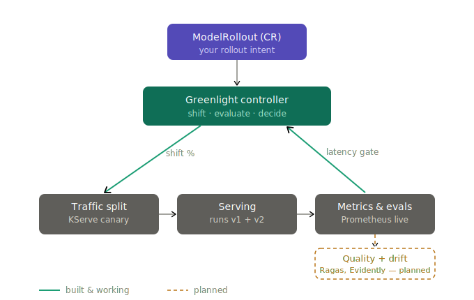

<h1 align="center">Greenlight</h1>

<p align="center"><b>Quality-gated progressive delivery for ML & LLM endpoints.</b><br>
<i>Flagger for models — promote a new model version only when live quality holds, roll back automatically when it doesn't.</i></p>

<p align="center">
<a href="#"></a>
<a href="#"></a>
<a href="#"></a>
</p>

---

## Architecture



Greenlight is the control plane that conducts tools you already run. It patches the
serving layer's own canary control, reads quality signals from your metrics stack,
and decides promote-or-rollback. It does not route requests or run evals itself.

---

## The problem

Shipping a new model or LLM version to production is a leap of faith. Your offline evals pass, you deploy, and a silent quality regression — a drop in faithfulness, a latency spike, a cost blowout — reaches users before you notice. Traditional progressive delivery (Argo Rollouts, Flagger) can canary a deployment, but it only understands **HTTP error rate and latency**. It has no idea whether your model's *answers* got worse.

Greenlight closes that gap. It's a Kubernetes controller that shifts traffic to a candidate model gradually, and at each step evaluates **model-quality gates** — eval scores, faithfulness, drift, latency p95, cost-per-request — against the stable baseline. All gates green, it advances. Any gate red, it rolls back. Automatically.

## Where Greenlight fits

| Tool category | Gates on | When | Greenlight difference |
|---|---|---|---|
| Eval-in-CI (Langfuse, Braintrust, Ragas) | eval scores | **before merge** (offline) | Greenlight gates on **live canary traffic**, post-deploy |
| LLM gateways (LiteLLM, Bifrost) | routing / cost | runtime | Greenlight is a **deployment controller**, not a request router |
| Service canary (Argo Rollouts, Flagger) | HTTP 5xx / latency | rollout | Greenlight gates on **model quality**, not just HTTP health |
| **Greenlight** | **eval + drift + latency + cost** | **progressive rollout** | **the empty slot: quality-gated runtime promotion** |

## How it works

```
ModelRollout (CR)  ──watched by──▶  Greenlight Controller
  stable: v1                          1. shift N% traffic → candidate
  candidate: v2                       2. sample live traffic → run gates
  steps: [5,25,50,100]                3. all green for window → advance
  gates: [quality≥0.85,               4. any red → rollback to stable
          p95<800ms]                  5. emit metrics + events each step
```

The controller **orchestrates existing tools** — it does not reimplement them. Serving is KServe, eval is Ragas/LLM-as-judge, metrics are Prometheus. Greenlight is the control plane that ties them into a quality-gated rollout.

## Quickstart (local demo, no GPU needed)

```bash
# 1. spin up a local cluster + install the CRD
make kind-up
make install

# 2. run the controller (simulate mode — no KServe/Ragas needed for the demo)
make run

# 3. in another shell: apply a rollout whose candidate is "worse"
kubectl apply -f examples/modelrollout-sample.yaml

# 4. watch Greenlight catch the regression and roll back
kubectl get modelrollout demo -w
```

In simulate mode the sample candidate fails its quality gate at the 25% step — you'll watch the phase walk `Progressing → RollingBack → RolledBack`. Flip the candidate to the "good" example to watch a full promotion instead.

## Status

Alpha, v0.3. Built and working: the controller loop, the `ModelRollout` CRD, traffic stepping with auto-rollback, the Prometheus p95 latency gate (with cold-metric handling), and **KServe traffic-shifting** via `canaryTrafficPercent`. The local demo runs in simulate mode with no serving stack required. Next: the quality + drift gates.

## Roadmap

Next up: quality gate (Ragas / LLM-as-judge) and drift gate (Evidently) — the dashed box in the diagram. Then: cost gate, shadow-traffic eval, blue-green mode, champion/challenger, Argo Rollouts metric-provider adapter, web UI, prompt-version rollouts.

## License

Apache 2.0.
